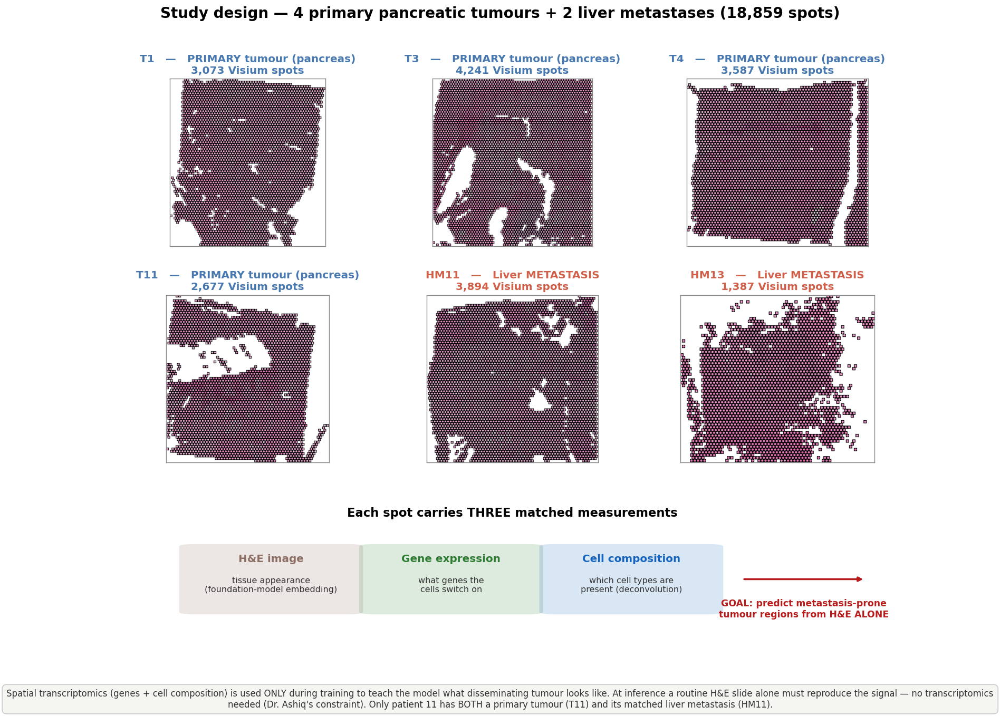
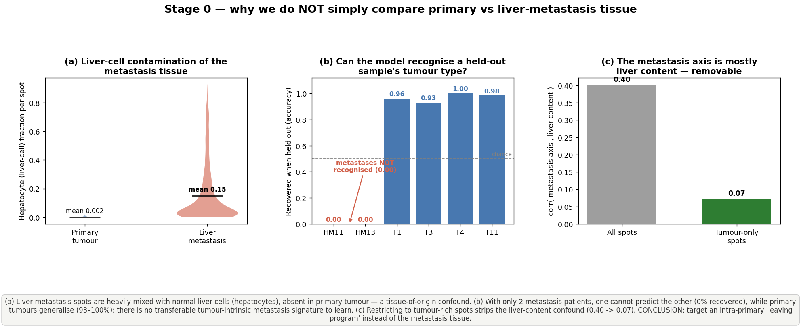
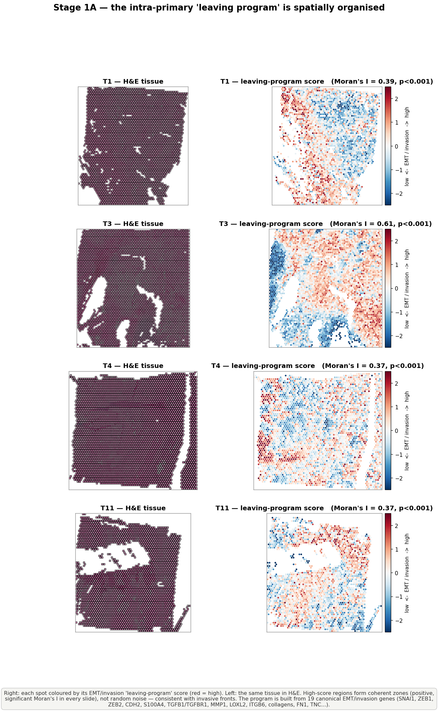
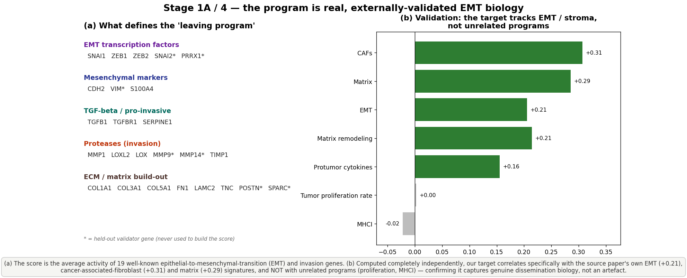
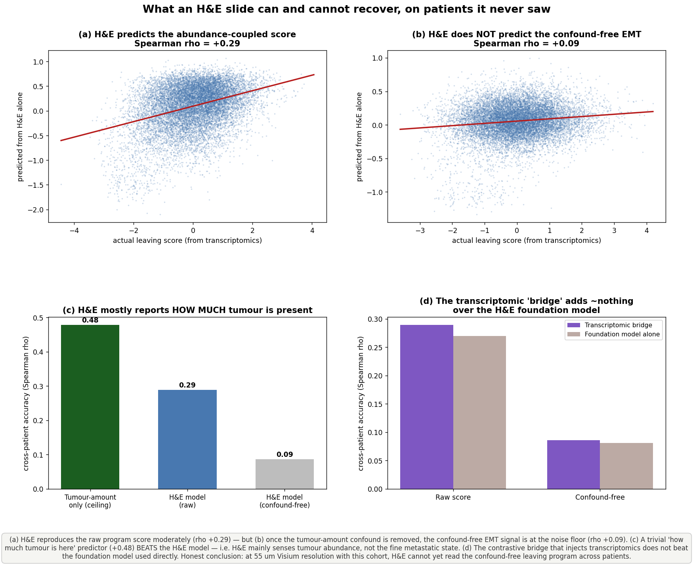
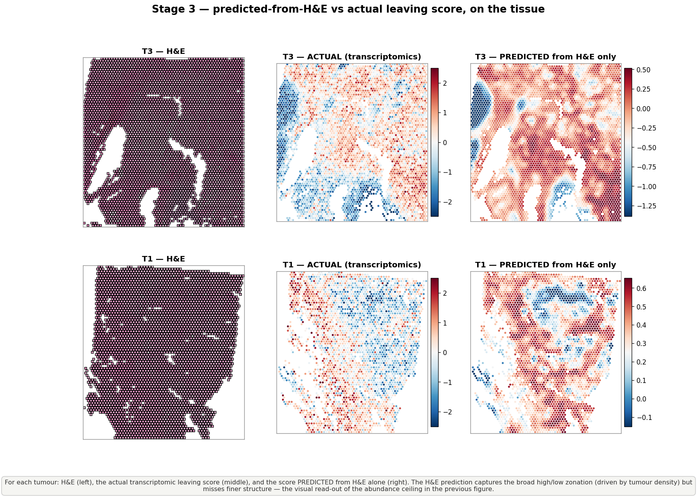
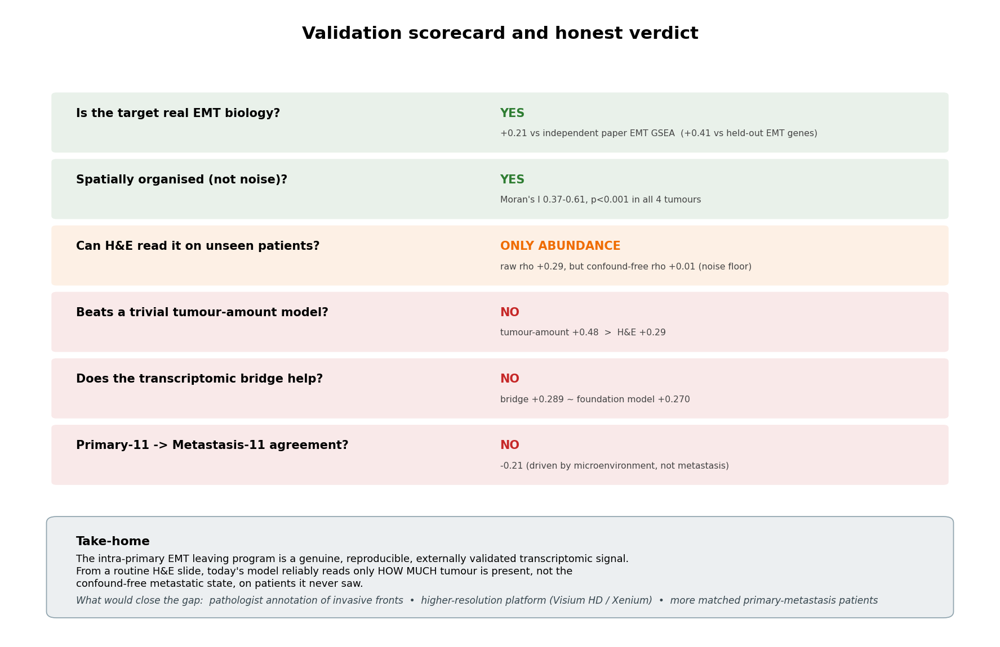
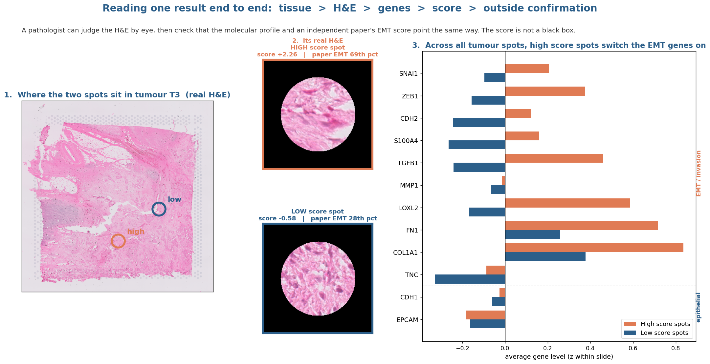

# The Project, Explained Simply — From Start to End

*A plain-language walkthrough of what we set out to do, how we did it, what we found, and
what it honestly means. No machine-learning background needed. Every section points to a real
figure in `Outputs/presentation_figures/` so you can see the result, not just read about it.*

---

## 0. The 30-second version

We wanted to **look at a routine pancreatic-cancer biopsy slide (an H&E image) and flag the
tumour regions that are most likely to be "getting ready to spread" to the liver** — without
needing expensive molecular tests at the time of diagnosis.

To train the model, we used a richer kind of data (**spatial transcriptomics**, which tells us
which genes are switched on at thousands of tiny locations across the tissue). The plan: let the
gene data *teach* the model during training, so that afterwards the model can work from the
**cheap H&E image alone**.

**What we found, honestly:**

> The biological signal we were chasing — an "EMT / leaving program" inside the primary tumour
> — is **real and independently confirmed**. But from an H&E image alone, on *patients the model
> has never seen*, the model can only reliably read **how much tumour is present**, not the finer
> "is it preparing to leave" state. The fancy multi-modal training added **nothing** over a
> standard image model. This is a rigorous, confound-audited negative-leaning result, and we know
> exactly what would push it further.

That honesty is the point. The pipeline is built to *catch itself cheating*, and it did.

---

## 1. The clinical problem — why this matters

Pancreatic cancer (PDAC) is deadly largely because it **spreads (metastasises) early**, most
often to the **liver**, frequently before anyone knows the patient is sick. If a pathologist
could look at the original pancreas tumour and point to the regions that are biologically
"primed to leave," that could eventually help with prognosis and treatment decisions.

The catch: the clue to "primed to leave" lives in the tumour's **gene activity**, which you don't
see in a normal H&E slide (the pink-and-purple stained image pathologists look at every day).
Measuring gene activity everywhere is expensive and not routine.

**The opportunity:** if a model could learn the link between *what the tissue looks like* (H&E)
and *what its genes are doing* (transcriptomics), then at the hospital you'd only need the H&E.

---

## 2. The big idea — "the teacher leaves the room"

Think of training a medical student with a **senior expert (the teacher) standing beside them**.
During training, the student sees both the slide **and** the expert's molecular read-out. The
goal is that, after enough training, the **student can make the call from the slide alone** — the
expert (the gene data) leaves the room at exam time.

- **Teacher (training only):** spatial transcriptomics — gene activity + cell makeup per spot.
- **Student (used forever after):** an image model that reads the H&E slide.
- **Hard rule from Dr. Ashiq:** gene data may be used to *train*, but **inference must use H&E
  only**. This is the whole design constraint.

---

## 3. The ingredients — our data

*Figure 1 — The question and the data.*

We have **6 tissue samples** from pancreatic-cancer patients, totalling **18,859 tiny tissue
locations ("spots")**:

| Type | Samples | What it is |
|------|---------|------------|
| **Primary Tumour (PT)** | T1, T3, T4, T11 | The original tumour in the pancreas |
| **Hepatic Metastasis (HM)** | HM11, HM13 | Tumour that already spread to the liver |

Only **patient 11** has *both* a primary (T11) and its matched liver metastasis (HM11). That
"only one matched pair" fact becomes important later.

**Each spot carries three kinds of information.** Here is what each one means in plain words:

1. **H&E image patch** — a small 224×224-pixel picture of the tissue at that spot (what a
   pathologist sees). We turn each patch into a list of numbers ("an embedding") using a
   **foundation model** — a large image network pre-trained on millions of pathology images.
   *Analogy: instead of raw pixels, we get the model's expert "impression" of the patch as a
   1,536-number fingerprint.* We tested several (UNI2-h, CONCH, H-Optimus); **UNI2-h** was our
   main one.

2. **Gene expression** — which of ~17,900 genes are switched on, and how strongly, at that spot.
   That's a huge, noisy list, so we compress it into a tidy **50-number summary** using a method
   called **scVI**. *Analogy: scVI is like turning a 17,900-page report into a clean 50-bullet
   executive summary that keeps the meaningful patterns and drops the noise.*

3. **Cell composition** — what *mix of cell types* sits in that spot (each spot contains several
   cells). A method called **RCTD** estimates the proportions of 15 cell types — e.g. *Tumour
   Epithelial cells* (the cancer), *Hepatocytes* (liver cells), *CAFs* (scar-forming cells),
   immune cells, etc. *Analogy: a recipe card — "this spot is 60% tumour, 15% liver, 10% scar,
   …".*

So every spot = one H&E picture + one 50-number gene summary + one 15-number cell recipe.
**These three views of the same spot are what we try to line up.**

---

## 4. The trap we deliberately avoided (Stage 0)

*Figure 2 — Why we don't simply compare "primary vs metastasis".*

The obvious first idea: *"Compare the primary tumours to the liver metastases, learn the
difference, and call that 'metastatic-ness'."* **This is a trap, and we proved it.**

The problem is a **confound** (a sneaky alternative explanation):

- Liver-metastasis spots are sitting **inside the liver**, so ~15% of their cells are actually
  **liver cells (hepatocytes)**. Primary-tumour spots are ~0% liver cells.
- So a model trained to tell "met vs primary" would mostly learn **"does this look like liver?"**
  — *tissue location*, not *metastatic biology*. (Figure 2c: that naive "metastasis axis" is
  0.40-correlated with liver content — strong — but drops to **0.07** once you restrict to
  tumour-rich spots. It really was mostly liver.)

We checked something else too (Figure 2b): with only **2** metastasis patients, **one cannot
predict the other** (0% recovered), while the 4 primaries generalise to each other fine
(93–100%). *Translation: the two liver mets don't share a common, transferable "metastasis
program" we could learn from. N=2 is just too small, and each is its own thing.*

**Decision (this changed the whole project):** stop trying to compare met-vs-primary across
patients. Instead, define the target **inside the primary tumours themselves**, where there's no
liver to confuse us. That target is the "leaving program," next.

> **Why this stage matters:** it's free insurance. A flashy model would have "worked" on the
> naive setup and quietly been a liver-detector. Catching that *before* training is the
> difference between a real result and a fooled one.

---

## 5. Defining the target the honest way (Stage 1)

### 5a. What is the "leaving program"?

When a cancer cell prepares to detach and travel, it goes through a well-known biological shift
called **EMT (epithelial-to-mesenchymal transition)** — roughly, it stops being a tidy, stuck-in-
place "epithelial" cell and becomes a mobile, invasive "mesenchymal" one. There are **textbook
genes** for this (SNAI1, ZEB1, MMP1, …).

We built a **"leaving-program score"** for each primary-tumour spot by measuring how strongly
these **19 canonical EMT / invasion genes** are switched on. *Analogy: a checklist — the more
"departure-prep" genes a spot has turned on, the higher its leaving score.* (The method,
"AddModuleScore," just averages those genes while subtracting a fair background so the score
isn't inflated by spots that are simply busy overall.)

### 5b. Is the leaving program actually real? (Two honesty checks)

*Figure 3 — The leaving program is spatially organised, not random.*

**Check 1 — Spatial coherence.** If the score were noise, high spots would be scattered randomly.
Instead, high-score spots form **coherent zones** in the tissue (Figure 3, right column vs the
H&E on the left), consistent with invasive fronts. We measured this with **Moran's I** (a
"clumpiness" statistic): 0.37–0.61, all highly significant. *Translation: the pattern is real
geography, not static.*

*Figure 4 — The program is the right biology, confirmed from outside.*

**Check 2 — Held-out genes + an outside dataset.** We built the score from one set of EMT genes
and then checked it against a **different** set of EMT genes we deliberately *kept out* — they
agreed. Even better, the **source paper's own independently computed EMT signature** agrees with
our score (**+0.21**), and so do its CAF (+0.31) and matrix (+0.29) signatures — while *unrelated*
programs don't. *Translation: an outside ruler confirms we're measuring genuine EMT biology, not
an artefact of our own method.*

### 5c. The confound inside the target (and how we handled it)

Here's the subtle part. Our leaving score turned out to be **0.61-correlated with how much tumour
is in the spot** ("tumour fraction"). Some of that is unavoidable: a spot with more tumour cells
naturally shows more tumour-gene activity. So part of the score reflects **abundance** ("how much
cancer is here"), not specifically **EMT state** ("is the cancer preparing to leave").

To be honest, we kept **two versions** of the target from here on:

- **`raw` score** — the full signal (includes the abundance component). The *abundance-aware
  upper bound*.
- **`resid` score** — the same score with the tumour-amount effect **mathematically removed**
  ("residualized"). This is the **confound-free headline** — pure EMT state, no abundance.

The residualized signal is genuinely clean, but also **weaker** (within-tumour EMT at this
resolution is a modest signal). Keep this fork — `raw` vs `resid` — in mind; it's the crux of the
final result.

---

## 6. Teaching the model (Stage 2 — the multi-modal "bridge")

Now the actual training. We tried to **line up the three views of each spot** (image, genes,
cells) in a shared mathematical space, using a technique called **contrastive learning**.

*Analogy: imagine three translators for the same sentence — one speaks "image," one speaks
"genes," one speaks "cells." Contrastive learning trains them so that the same spot lands in the
same place no matter which language describes it, and different spots land far apart.* The idea is
that, by being forced to agree with the gene/cell views during training, the **image translator
secretly absorbs the biology** — so later it can stand alone.

We were careful to avoid two classic ways of fooling ourselves:

- **Slide-identity shortcut:** we balanced training across all 6 slides so the model couldn't
  cheat by just memorising "which slide is this."
- **Spatial-autocorrelation inflation:** neighbouring spots look almost identical, so naive
  "did it find the match?" scores look great for trivial reasons. We **excluded close neighbours**
  from the test. This is crucial — it's where the honest result first appeared.

**Honest result of Stage 2:** once we excluded neighbours and tested on **patients the model
never saw**, the bridge's matching ability was **basically chance**. The earlier "looks great"
numbers were the spatial-autocorrelation illusion. *In plain terms: the three-way alignment did
not learn a transferable image↔gene link across patients.*

We compared 4 image foundation models and picked **UNI2-h** to carry forward, but the headline
was already clear: the bridge was not pulling its weight. So we ran a decisive test next.

---

## 7. Reading it from H&E, and the ceiling (Stage 3)

*Figure 5 — What H&E can and cannot recover on unseen patients.*

We trained the final predictor the rigorous way: **leave-one-patient-out**. The model learns from
3 primary tumours and is tested on the 4th it has *never seen* — repeated for all 4. This is the
honest test of "will it work on a new patient?"

Four findings, all in Figure 5:

1. **(a) H&E predicts the `raw` score moderately** — correlation **+0.29**. Not nothing.
2. **(b) But the confound-free `resid` (pure EMT) is at the noise floor** — about **+0.09**.
   *Translation: once you remove "how much tumour," there's almost nothing left that H&E can read
   on a new patient.*
3. **(c) A trivially simple "just measure how much tumour" model scores +0.48 — and BEATS our
   H&E model (+0.29).** This is the humbling one: the fancy model's only real signal is tumour
   abundance, and you can get *more* of that from a one-line baseline.
4. **(d) The multi-modal bridge ≈ the plain frozen image model.** Side by side: bridge **0.289**
   vs frozen-FM-alone **0.270** — **tied** (difference +0.005). *Translation: all the
   transcriptomics-injection machinery added essentially nothing over just using the off-the-shelf
   image model.*

*Figure 6 — The same ceiling, seen on the tissue.*

Figure 6 shows it visually for two tumours: **H&E | the actual leaving score | the score predicted
from H&E**. The prediction captures the **broad** high/low zones (because those track tumour
density) but **smooths away the fine detail** — exactly what the numbers said.

**Decision:** drop the bridge from the deployment path entirely. The final predictor is a
**direct regression from the frozen image model to the leaving score**. (This still honours
Dr. Ashiq's rule: gene data *defined the target* during training but is **never used at
inference**.)

---

## 8. The honest verdict (Stage 4 — independent validation)

*Figure 7 — Six pre-registered tests, with pass/fail.*

We wrote down the tests **before** trusting any score (so we couldn't move the goalposts), and we
brought in **external evidence**: the source paper's own spot-by-spot scores for 29 biological
signatures (including EMT), which lined up with our spots 100%. Results:

- **Target validity (PASS):** our leaving target genuinely matches the independent paper's EMT
  signature (+0.205). **The biology is real.** ✔
- **H&E recovery of pure EMT (FAIL):** the confound-free EMT signal predicted from H&E is at the
  noise floor (+0.006). **You can't read it from the slide on unseen patients.** ✘
- **Patient-11 anchor (FAIL):** high-scoring primary spots did **not** resemble the matched liver
  met — that axis is microenvironment, not metastasis. ✘
- **Invasive-margin test (FAIL the hypothesis):** scores were higher in the tumour *interior*
  than at the margin — again abundance-driven, not invasive-front-specific. ✘
- **Negative control (PASS):** the confound-free score is properly decorrelated from liver/abundance
  confounders. ✔ — but the **abundance ceiling was not beaten** (the trivial tumour-amount model
  still wins).

**The locked, honest one-liner (use this in any talk):**

> The intra-primary EMT "leaving program" is a real, externally-validated transcriptomic signal;
> but from a routine H&E slide our model currently recovers only **how much tumour is present**,
> not the confound-free metastatic state, on unseen patients.

---

## 9. A worked example — one result, traceable end to end

*Figure (worked example) — tissue → H&E → genes → score → outside confirmation.*

To show the score is **not a black box**, we trace two real spots from tumour T3:

1. **Where they sit** (left): one **high-score** spot and one **low-score** spot, marked on the
   real tissue.
2. **Their actual H&E** (middle): a pathologist can judge the morphology by eye.
3. **The molecular proof** (right): across *all* tumour spots, the **high-score group has the
   EMT/invasion genes (SNAI1, ZEB1, MMP1, …) switched ON** and epithelial genes down, while the
   low-score group is the reverse. The high spot also lands in the **69th percentile** of the
   independent paper's EMT score; the low spot in the **28th**.

So the chain holds: *tissue location → what it looks like → which genes are on → our score → an
outside ruler agrees.* The score means what we say it means.

---

## 10. What it means, and what would push it further

**What we genuinely delivered:**
- A **rigorous, confound-audited pipeline** that defines, validates, and scores an intra-tumour
  EMT "leaving program" — and, crucially, **knows the difference between real biology and a
  confound**.
- A clear, honest finding: at current resolution, **H&E reliably reads tumour abundance, not the
  fine metastatic state**, on unseen patients; and the multi-modal bridge adds nothing over a
  standard image model.

**Why it's limited (the real reasons, not excuses):**
- **Resolution:** each Visium "spot" is ~55 µm and contains several cells mixed together; the
  subtle within-tumour EMT signal gets blurred.
- **Tiny matched cohort:** only **1** patient has both primary and metastasis; only 2 mets total.
  There simply isn't enough to learn a cross-patient metastasis program.
- **No ground-truth annotation yet:** no pathologist has marked the true invasive fronts to score
  against.

**What would close the gap (the roadmap):**
1. **Pathologist annotation** of invasive margins from Dr. Ashiq — the single most valuable
   missing piece.
2. **Higher-resolution platforms** (Visium HD / Xenium) — single-cell resolution would un-blur
   the EMT signal.
3. **More matched primary–metastasis patients** — to make a cross-patient program learnable at
   all.

---

## 11. Mini-glossary (plain definitions)

| Term | Plain meaning |
|------|---------------|
| **H&E** | The standard pink/purple stained tissue slide pathologists read. |
| **Spatial transcriptomics (Visium)** | A technology that measures gene activity at thousands of tiny spots laid over a tissue slide, keeping their X/Y locations. |
| **Spot** | One tiny tissue location (~55 µm) with its own image patch + gene readout + cell mix. |
| **Foundation model (UNI2-h, CONCH…)** | A large image network pre-trained on millions of pathology images; turns a patch into a numeric "fingerprint." |
| **Embedding** | A list of numbers summarising something (an image patch, a gene profile) so a computer can compare them. |
| **scVI** | A method that compresses ~17,900 noisy gene measurements into a clean 50-number summary. |
| **RCTD** | A method that estimates the **mix of cell types** in each spot (tumour %, liver %, scar %, …). |
| **EMT / "leaving program"** | The biological shift a cancer cell makes when preparing to detach, invade, and spread. |
| **Confound** | A sneaky alternative explanation (e.g. "looks like liver") that can masquerade as the thing you care about ("metastatic-ness"). |
| **Residualize** | Mathematically subtract a confound (here, "how much tumour") so what's left is the clean signal. |
| **Contrastive learning** | Training that pulls matching things together and pushes non-matching things apart in a shared space. |
| **Leave-one-patient-out (LOSO)** | Honest testing: train on some patients, test on a patient never seen. The real measure of generalisation. |
| **Moran's I** | A "clumpiness" score — high means high-value spots cluster together (real geography, not noise). |
| **Correlation (ρ)** | How strongly two things move together: 0 = unrelated, ~1 = move in lockstep. +0.29 = moderate, +0.09 = near nothing. |
| **Noise floor** | The level of "signal" you'd get from pure randomness — being *at* it means there's no real signal left. |

---

*All figures referenced above are in `Outputs/presentation_figures/` (full size) and
`Outputs/presentation_figures/slides/` (slide-formatted). Talking points per figure are in
`Outputs/presentation_figures/README_presentation.md`. The full technical execution log is in
`REVIEW_PLAN.md`.*
